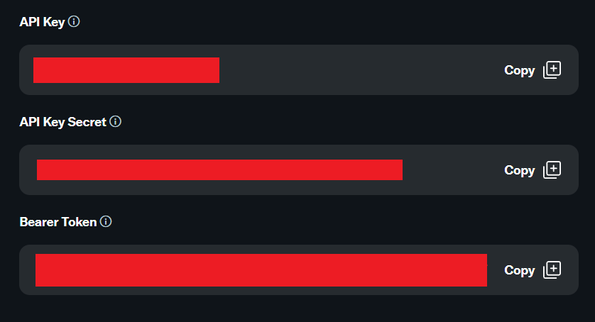
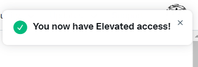
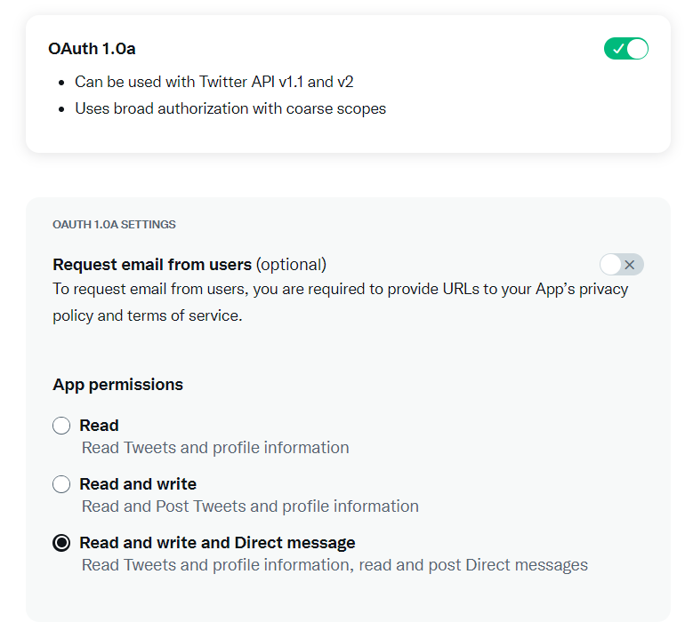

# Uso básico de API Twitter 🐦

 Este repositorio sirve como guía de inicio para usar la API de twitter y comenzar a automatizar tareas mediante tweepy

 Incluye funciones para autentificar tus credenciales o mandar tweets automatizados de manera simple, ademas de una guía para configurar tu cuenta de desarrollador en twitter.
# El repositorio incluye las siguientes funciones:
## autentificar(*api_key, api_secret, access_token, access_secret*)

```
#Comprueba tus credenciales, guardalas en un objeto para interactuar con la API

api = autentificar(api_key, api_secret, access_token, access_secret)
```

## basic_tweet(*api, text*)
```
#Envía tweets

api = autentificar(api_key, api_secret, access_token, access_secret)
basic_tweet(api, "Hola mundo")
```


## media_tweet(*api, img_path, text=""*)
```
#Envía tweets multimedia, con texto opcional

api = autentificar(api_key, api_secret, access_token, access_secret)
media_tweet(api, "imgs/img_0.png", "TEST")
```

## random_basic_tweet(*api, list*)
```
#Envía un string aleatorio de una lista

tweets = ["TEST", "Probando", "Esto es un tweet", ":)"]
api = autentificar(api_key, api_secret, access_token, access_secret)
random_basic_tweet(api, tweets)
```


## random_media_tweet(*api, img_path, text=""*)
```
#Envía contenido multimedia aleatorio de una lista, solo hay que añadir imagenes a la ruta especificada

img_path = "imgs/"    
api = autentificar(api_key, api_secret, access_token, access_secret)
random_media_tweet(api, img_path)
```

## random_media_loop_tweet(*api, minutes, img_path, text=""*)
```
Mandar contenido multimedia aleatorio de manera continuada cada 30 minutos

img_path = "imgs/"
minutos_entre_tweets = 30
api = autentificar(api_key, api_secret, access_token, access_secret)
random_media_loop_tweet(api, minutos_entre_tweets, img_path)
```

  
# Registrar una cuenta de desarrollo en Twitter:
- Si vas a crear un bot con una cuenta de twitter nueva, deslogeate antes de todas tus cuentas activas en twitter.
- Entra aqui https://twitter.com/i/flow/signup y registrate.
- Asegúrate de tener un telefono asociado a tu cuenta de twitter:
https://twitter.com/settings/phone
- Si ya tienes una cuenta, entra aqui:
https://developer.twitter.com/en/portal/petition/essential/basic-info
- Completa el registro 
- Acepta los terminos y condiciones
- Una vez completes la confirmación en el email que te mandan, te redirigirán aqui: 
- Introduce el nombre de tu bot y continúa
- Recibirás tres tokens, guardalos en api_data.py: 
- Haz click aqui: https://developer.twitter.com/en/portal/petition/standard/basic-info
- Rellena la información que te piden, añade una descripcion sobre el bot que vas a crear y completa todo el proceso de registro.
- Si todo ha ido bien, recibiras un aviso:
- Haz click aqui: https://developer.twitter.com/en/portal/projects/1549054564472602625/apps/24894540/auth-settings
- Habilita OAuth 1.0a y da permisos a tu aplicación para leer y escribir tweets y mensajes directos: 
- Añade una URL callback y de website (cualquier url vale) y haz click en enviar.
- Haz click aqui: https://developer.twitter.com/en/portal/projects/1549054564472602625/apps/24894540/keys
- Haz click en "Generate" dentro de "Access Token and Secret", esto nos dará nuestros dos ultimos tokens necesarios, guardalos en api_data.py

¡Listo! Ya tienes todo lo necesario para interactuar con la API de twitter🙂

# Usando el repositorio:
- Clona el repositorio a tu PC:
  ````
  git clone https://github.com/datadiego/twitter_api_basics.git
- Crea un entorno virtual en el directorio del proyecto:
  ```
  python -m venv env
  ```
- Activa el entorno virtual
  ```
  #Windows
  .\env\Scripts\activate

  #Mac/Linux:
  source ./env/bin/activate
- Instala dependencias:
  ```
  pip install -r requirements.txt
  ```
- Una vez tengas el archivo api_data.py listo, intenta ejecutar autentificación.py para asegurarte de que todo funciona correctamente.

# Errores enviando tweets
## 187 - Status is a duplicate
- Has intentado mandar un tweet duplicado, intenta mandar otro distinto.
- Funciones que envian contenido aleatorio como random_media_continuous pueden producir este fallo.

# Error de autentificacion:
## 401 Unauthorized 
### 32 - Could not authenticate you
- Configura correctamente tu api_key y tu api_secret en api_data.py
- Comprueba que estas trabajando en el entorno virtual del proyecto.
## 400 Bad Request
### 215 - Bad Authentication data
- Configura correctamente tu access_token y tu access_secret en api_data.py
- Comprueba que estas trabajando en el entorno virtual del proyecto
