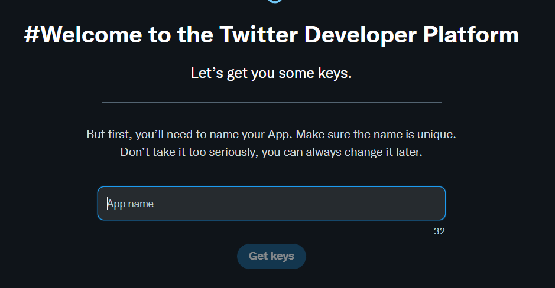
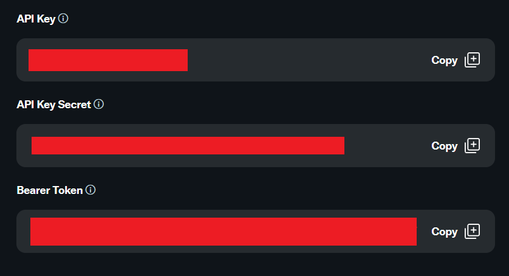
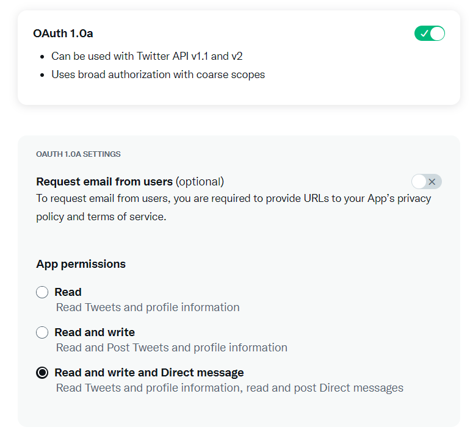

# Uso básico de API Twitter 🐦

 Este repositorio sirve como guía de inicio para usar la API de twitter y comenzar a automatizar tareas mediante tweepy

Para comenzar a usar la API:
- Clona e instala el repositorio.
- Registra una cuenta de desarrollo en Twitter.
- Guarda tus claves en un lugar seguro, lanza "configuracion.py" y sigue las instrucciones.
- Si todo va bien, deberías estar listo para interactuar con la API 🙂

 La libreria contiene funciones para confogurar y autentificar tus credenciales o mandar tweets automatizados de manera simple y entender como funciona la API, una guía para crear y configurar tu cuenta de desarrollador en twitter y una clase (tweet_bot.py) con las siguientes funciones:
 
- `authenticate(*self, api_key, api_secret, access_token, access_secret*)`: Verifica tus credenciales para interactuar con la API.
- `show_info()`: muestra información sobre tu perfil.
- `get_last_tweet()`: captura el ultimo tweet enviado.
- `get_last_tweet_id()`: captura el id del ultimo tweet enviado.
- `delete_last_tweet()`: elimina el ultimo tweet enviado.
- `delete_tweets(*amount*)`: elimina varios tweets empezando desde el ultimo enviado.
- `delete_all_tweets()`: elimina todos los tweets de la cuenta.
- `get_tweets(*amount*)`: captura varios de tus ultimos tweets enviados.
- `get_tweets_id(*amount*)`: captura varios ids de tus tweets empezando desde el ultimo.
- `send_media(*media_path, text*)`: envia archivos multimedia, con texto opcional.
- `send_random_media(*self, media_path, text*)`: envia archivos aleatorios multimedia desde un directorio.
- `add_texts_to_send(*list*)`: almacena una lista de textos para poder mandarlos en los modos aleatorios.
- `send_random_text()`: envía un texto aleatorio de la lista.
- `send_random_media_period(*minutes, img_path, text*)`: envía archivos multimedia aleatorios de manera periodica, en minutos.

# Instalando el repositorio:
- Clona el repositorio a tu PC:
  ````
  git clone https://github.com/datadiego/twitter_api_basics.git
- Crea un entorno virtual en el directorio del proyecto:
  ```
  python -m venv env
  ```
- Activa el entorno virtual
  ```
  #Windows
  .\env\Scripts\activate

  #Mac/Linux:
  source ./env/bin/activate
- Instala dependencias:
  ```
  pip install -r requirements.txt
  ```
- Listo! 🎊 Ya puedes crear tu cuenta de desarrollo y comenzar la configuración de la librería

# Registrar una cuenta de desarrollo en Twitter:
- Si vas a crear un bot con una cuenta de twitter nueva, deslogeate antes de todas tus cuentas activas en twitter.
- Entra aqui https://twitter.com/i/flow/signup y registrate.
- Asegúrate de tener un telefono asociado a tu cuenta de twitter:
https://twitter.com/settings/phone
- Si ya tienes una cuenta, entra aqui:
https://developer.twitter.com/en/portal/petition/essential/basic-info
- Completa el registro 
- Acepta los terminos y condiciones
- Una vez completes la confirmación en el email que te mandan, te redirigirán aqui: 
- Introduce el nombre de tu bot y continúa
- Recibirás tres tokens, guardalos en un lugar seguro: 
- Haz click aqui: https://developer.twitter.com/en/portal/petition/standard/basic-info
- Rellena la información que te piden, añade una descripcion sobre el bot que vas a crear y completa todo el proceso de registro.
- Si todo ha ido bien, recibiras un aviso:
- Haz click en `⚙️App Settings` dentro del portal de desarrollo: https://developer.twitter.com/en/portal/dashboard
- Habilita OAuth 1.0a y da permisos a tu aplicación para leer y escribir tweets y mensajes directos: 
- Añade una URL callback y de website (cualquier url vale) y haz click en enviar.
- Haz click en `🔑Keys and Tokens` dentro del portal de desarrollo: https://developer.twitter.com/en/portal/dashboard
- Haz click en `Generate` dentro de `Access Token and Secret`, esto nos dará nuestros dos ultimos tokens necesarios, guardalos junto a tu api_key, tu api_secret y tu bearer_token.

¡Listo! localiza el archivo `configuration.py` en la carpeta `resources` y ejecutalo para configurar tu archivo `api_data.py` donde guardaremos los tokens.

Si todo va bien, estarás listo para interactuar con la API de twitter y la librería, dentro de resources encontrarás varias funciones para entender como funciona la librería.

# Errores enviando tweets
## 187 - Status is a duplicate
- Has intentado mandar un tweet duplicado, intenta mandar otro distinto.
- Funciones que envian contenido aleatorio como random_media_continuous pueden producir este fallo.

# Error de autentificacion:
## 401 Unauthorized 
### 32 - Could not authenticate you
- Configura correctamente tu api_key y tu api_secret en api_data.py
- Comprueba que estas trabajando en el entorno virtual del proyecto.
## 400 Bad Request
### 215 - Bad Authentication data
- Configura correctamente tu access_token y tu access_secret en api_data.py
- Comprueba que estas trabajando en el entorno virtual del proyecto
